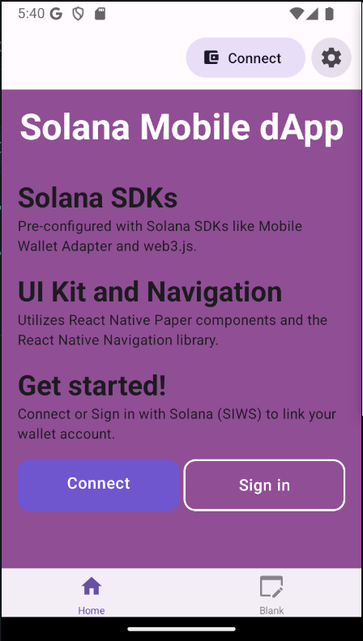
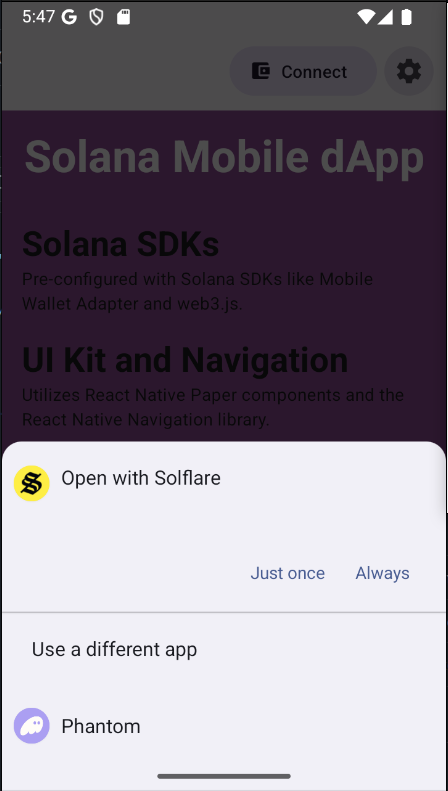
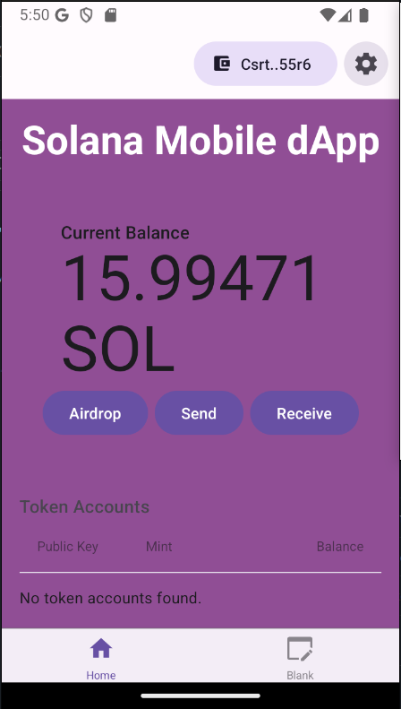

# Solana Mobile React Native Expo dApp

This is a ready-to-go react native expo mobile app example for building Solana mobile dApps.

# Demo
<table>
  <tr>
    <td align="center">
      
    </td>
    <td align="center">
      
    </td>
    <td align="center">
      
    </td>
  </tr>
</table>

# Support
1. Stuck while building Solana mobile apps using any example in this repo? - Don't worry, I have created a dedicated support channel in dPU Official Discord server, join to meet other Solana Mobile Developers, ask for support and support others. [dPU Solana Mobile Devs Support Channel](https://dProgrammingUniversity.com/discord).

2. Join mailing list to stay upto to date with what examples and tools am working on and adding next - [Web3 Devs Newsletter](https://dprogramminguniversity.com/newsletter)

3. DONATE: - To help keep this project going, adding new examples codes and updating existing ones. Kindly consider [DONATING](https://dprogrammingUniversity.com/donation) and donation of $50USDC and above will have you added to the donors list on this [Solana Mobile dApp Examples Repo Homepage](https://github.com/dProgrammingUniversity/solana-mobile-dapp-examples) - THANK YOU!

4. If find this repo helpful PLEASE remember to give it a STAR ⭐️ and share to other devs on social media.


# Guide

## A. Video
Watch the step by step course where I guide on building your first Solana mobile dApp with React Native Expo using this example app code step by step at [Solana Mobile Development Course - Learn React Native Expo To Build Apps on Solana](https://www.youtube.com/watch?v=8R56pwC_Kk0)

## B. Pre-requisites 
- [Solana mobile development enviroment setup](https://docs.solanamobile.com/developers/development-setup)
- React Native Expo knowledge - (Watch above course video to learn the basics even if never built mobile apps before)
- Emulator/Physical Android device - for testing your Solana Mobile dApp (Solana phones like Seeker are Android based, so you should be fine testing your app on Android emulator or real Android phones)
- MWA compatible wallets (Solflare, Phantom etc.)

## C. Techstack
- React Native
- Expo
- Android Emulator
- Solana Mobile Wallet Adapter (MWA)

## D. Steps
1. Ensure you are in the right folder `first-mobile-dapp` in your terminal.
```sh
cd first-mobile-dapp
```

2. Install dependencies. Though am a fan of `PNPM`, it is known to have issues with React Native Expo sometimes. So, I switched to `yarn` when building with react native expo.
```sh
yarn install
```

3. Build this sample app into an Android app apk.
```sh
eas build --profile development --platform android --local
```
NOTE: This could take between `5minutes` to `30minutes`. So, be patient and don't interupt it even if displayng some error messages along the way until its done. Mine took `[RUN_GRADLEW] BUILD SUCCESSFUL in 5m 52s` to completely build the `apk` successfully.

4. Install the `apk` into an Android Emulator.
```sh
To do so, drag and drop the `apk` file into your Android emulator
```
5. Install the `apk` into a Physical Android device. Connecct your device with USB to your PC and confirm if connected with command:
```sh
adb devices
```
Then install with command below. Kindly remember to change the apk name `build-1749804139031` to match your generated apk precisely to avoid errors. Also ensure this command is run within the project folder where the apk was generated and saved (For errors, check FAQs section below for fixes).
```sh
adb install build-1749804139031.apk
```

If you need to reinstall over the same existing apk installation, use:
```sh
adb install -r build-1749804139031.apk
```

NOTE: Before running the command below to start the app for development, you need to decide which are you using for testing - Emulator or real Android device and not both at same time to avoid confusion. I suggest, you install and test first in emulator and then can move to real device.

6. Run the app
```sh
npx expo start
```
OR include the `--dev-client` flag.
```sh
npx expo start --dev-client
```

7. NOTE: When the server client start successfully without errors, then use `a` to auto-launch the previously installed `apk` to connect it to your development and help reflect real time changes from your code in the app as you build live. When no live feedback after updating code, use `r` to reload the app in your emulator/device.

8. You can test and start customizing as desired.


# FAQs
1. ERROR: ```File 'expo/tsconfig.base' not found.ts
Path to base configuration file to inherit from (requires TypeScript version 2.1 or later), or array of base files, with the rightmost files having the greater priority (requires TypeScript version 5.0 or later).``` OR it may include error message `Cannot use JSX unless the '--jsx' flag is provided.ts(17004)` in the components and other files.

- FIX: Go to `tsconfig.json`, hover mouse on the error `"expo/tsconfig.base"` and click `Follow link`. it will open into the types file `tsconfig.base.json`. Thats the correct file, so add `.json` to correctly link it like so: `expo/tsconfig.base.json`. Save the `tsconfig.json` file and the errors should be fixed across your app.

2. ERROR: ```CommandError: No development build (com.dpu.counterdapp) for this project is installed. Please make and install a development build on the device first.``` 
- FIX: You need to build and install the apk first in the Emulator/Android device you want to test with before running the ```npx expo start``` command.

3. ERROR: When run `adb install build-1749804139031.apk` and it returns error message `adb: more than one device/emulator`.
- FIX: This is caused due to having multiple devices connected at same time and `adb` is confused which you want to install the apk into precisely. To Solve this, identify the ID of the device and use `-s` flag to point it there. 

- An example is `adb -s 02602536G0081003 install build-1749804139031.apk` or `adb -s emulator-5554 install build-1749804139031.apk` where `02602536G0081003` represents id of real Android device and `emulator-5554` represents id of opened Emulator. 
Using the `-s id-of-device` help remove confusion and guide `adb` to install the `apk` in the right device you want. After successfully installed into the targeted device, you will get message like `Performing Streamed Install. Success`.

- If you need to reinstall over an existing installation, add the `-r` flag: `adb -s 02602536G0081003 install -r build-1749804139031.apk` or `adb -s emulator-5554 install -r build-1749804139031.apk`.

# Solana Mobile Expo Template
This is built off of version 2.2.1 of the [official Solana Mobile Expo Template](https://github.com/solana-mobile/solana-mobile-expo-template) 