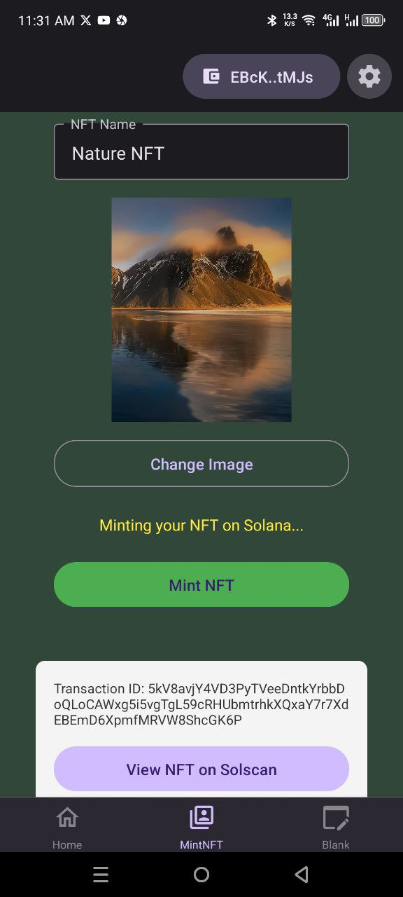

# Solana Mobile Metaplex Core Asset NFT Minter dApp

This Solana mobile dApp example demonstrates how to mint NFT on Solana using Metaplex Core NFT standard and the Solana Mobile Stack. 

Developers will learn to create a Solana NFT minter dApp that works natively on mobile devices, leveraging Anchor programs, Solana Mobile Wallet Adapter, React Native Expo and decentralized storage (IPFS via Pinata).

# Demo
<table>
  <tr>
    <td align="center">
      
    </td>
    <td align="center">
      
    </td>
    <td align="center">
      
    </td>
  </tr>
</table>
<table>
  <tr>
    <td align="center">
      
    </td>
    <td align="center">
      
    </td>
    <td align="center">
      
    </td>
  </tr>
</table>


# Support
1. Stuck while building Solana mobile apps using any example in this repo? - Don't worry, I have created a dedicated support channel in dPU Official Discord server, join to meet other Solana Mobile Developers, ask for support and support others. [dPU Solana Mobile Devs Support Channel](https://dProgrammingUniversity.com/discord).

2. Join mailing list to stay upto to date with what examples and tools am working on and adding next - [Web3 Devs Newsletter](https://dprogramminguniversity.com/newsletter)

3. DONATE: - To help keep this project going, adding new examples codes and updating existing ones. Kindly consider [DONATING](https://dprogrammingUniversity.com/donation) and donation of $50USDC and above will have you added to the donors list on this [Solana Mobile dApp Examples Repo Homepage](https://github.com/dProgrammingUniversity/solana-mobile-dapp-examples) - THANK YOU!

4. If find this repo helpful PLEASE remember to give it a STAR ⭐️ and share to other devs on social media.


# Guide

## A. Video
I did a demo video for how this mobile app allow user to upload image from their mobile phone and mint it as NFT on Solana - [Solana Mobile dApp Examples 4a: Metaplex Core Asset NFT Minter dApp Demo](https://youtube.com/shorts/lZ-8Rm7ianM)

NOTE: If you are totally new to Solana mobile development, this might not be the example to start with. You want to [learn to build your first Solana mobile dApp with this example](https://github.com/dProgrammingUniversity/solana-mobile-dapp-examples/tree/main/first-mobile-dapp) first and come back to this after.

## B. Pre-requisites 
- [Solana mobile development enviroment setup](https://docs.solanamobile.com/developers/development-setup)
- React Native Expo knowledge - (Watch above course video to learn the basics even if never built mobile apps before)
- Emulator/Physical Android device - for testing your Solana Mobile dApp (Solana phones like Seeker are Android based, so you should be fine testing your app on Android emulator or real Android phones)
- MWA compatible wallets (Solflare, Phantom etc.)

## C. Mobile dApp Workflow
1. 📸 User selects image from mobile phone gallery

2. ☁️ Image + metadata uploaded to IPFS (Pinata)

3. 🛠️ Anchor program mints NFT on Solana devnet using Metaplex Core NFT standard:
```sh
CreateV2CpiBuilder::new(...)
  .name(name)
  .uri(metadata_uri)
  .plugins(vec![Plugin::FreezeDelegate(...)])
  .invoke()
  ```
4. 🔍 View minted NFT on Solscan explorer  

## D. Techstack
- Metaplex Core (NFT Standard)
- IPFS (via Pinata)
- Rust
- Anchor
- React Native
- Expo
- Android Emulator
- Solana Mobile Wallet Adapter (MWA)

## Pre-Steps:
Before proceeding, you need a way to upload the NFT `image` and `metadata` to a decentralized storage `IPFS`. And we are using `Pinata` to achieve this.

Follow steps below to set it up:
1. Setup an account with [Pinata](https://pinata.cloud/)
2. Start with the FREE plan for testing and can upgrade later if your usage goes beyond the free limit
3. Get your Pinata `API Key` and `API Secret Key` 
4. Create a new file `.env` and copy the content in the example `.env.example` into it.
5. Replace the `your_pinata_api_key_here` with your Pinata `API Key` and `your_pinata_api_secret_here` with your Pinanta `API Secret Key` without space like `api_key=12345`.

## E. Steps
1. Ensure you are in the right folder `metaplex-core-asset-nft-minter-dapp` in your terminal.
```sh
cd metaplex-core-asset-nft-minter-dapp
```


2. Install dependencies. Though am a fan of `PNPM`, it is known to have issues with React Native Expo sometimes. So, I switched to `yarn` when building with react native expo.
```sh
yarn install
```

3. Build this sample app into an Android app apk.
```sh
eas build --profile development --platform android --local
```
NOTE: This could take between `5minutes` to `30minutes`. So, be patient and don't interupt it even if displayng some error messages along the way until its done. Mine took `[RUN_GRADLEW] BUILD SUCCESSFUL in 5m 42s` to completely build the `apk` successfully.

4. Install the `apk` into an Android Emulator.
```sh
To do so, drag and drop the `apk` file into your Android emulator
```
5. Install the `apk` into a Physical Android device. Connecct your device with USB to your PC and confirm if connected with command:
```sh
adb devices
```

Then install with command below. Kindly remember to change the apk name `build-1749804139031` to match your generated apk precisely to avoid errors. Also ensure this command is run within the project folder where the apk was generated and saved (For errors, check FAQs section below for fixes).
```sh
adb install build-1749804139031.apk
```

If you need to reinstall over the same existing apk installation, use:
```sh
adb install -r build-1749804139031.apk
```

NOTE: Before running the command below to start the app for development, you need to decide which are you using for testing - Emulator or real Android device and not both at same time to avoid confusion. I suggest, you install and test first in emulator and then can move to real device.

6. Run the app
```sh
npx expo start
```
OR include the `--dev-client` flag.
```sh
npx expo start --dev-client
```

7. NOTE: When the server client start successfully without errors, then use `a` to auto-launch the previously installed `apk` to connect it to your development and help reflect real time changes from your code in the app as you build live. When no live feedback after updating code, use `r` to reload the app in your emulator/device.

8. You can test and start customizing as desired.


# FAQs
See answers to [Solana Mobile Development FAQs HERE](https://github.com/dProgrammingUniversity/solana-mobile-dapp-examples/tree/main/FAQs)